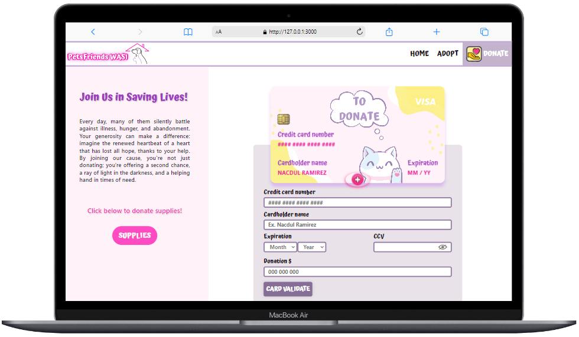
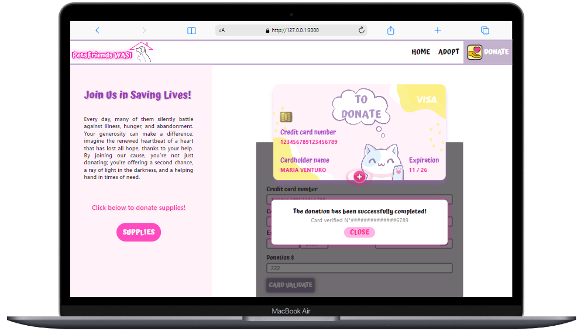

# DONATÓN PetsFriends Wasi-Card Validation

Para dirigirse a esta aplicación debe ingresar al siguiente link: <falta la página>

# ÍNDICE

* [1. Introduccion](#1-introducción)
  * [1.1 Aplicacion del proyecto](#11-aplicación-del-proyecto)
  * [1.2 Intefaz del usuario](#12-interfaz-del-usuario)
* [2. Resumen del Proyecto](#2-resumen-del-proyecto)
* [3. Experiencia de usuario](#3-experiencia-de-usuario)
* [4. Diseño](#4-diseño)
  * [4.1 Prototipo de baja fidelidad](#41-prototipo-de-baja-fidelidad)
  * [4.2 Prototipo de alta fidelidad](#42-prototipo-de-alta-fidelidad)
  * [4.3 Paleta de colores](#43-paleta-de-colores)
* [5. Ejecucion local](#5-ejecución-local)
* [6. Autora](#6-autora)

***

# 1. INTRODUCCIÓN

Este proyecto consiste en desarrollar una página web que permita verificar o validar por medio de un formulario cualquier número de tarjeta de crédito empleando el Algoritmo de Luhn.
Para ello, diseñé una web llamada PetsFriends Wasi, la cual es una simulación de una página de una fundación sin fines de lucro que ayuda a los animales en situación de abandono o maltrato.

## 1.1 APLICACIÓN DEL PROYECTO

Para que tu donación sea válida el formulario evaluará lo siguiente:

• Ningún input se debe dejar vacío.

• El input nombre no contiene números.

• El input del número de tarjeta no contiene letras.

• El input del año es igual o mayor al año actual.

• El input de CCV tiene una extensión de 3 dígitos y debe tener la opción de mostrar u ocultar dígitos simulando una contaseña.

• La tarjeta se validará a través de la función isValid, en la que se aplicará el algoritmo de Luhn.

• Tu N° de tarjeta debe tener mínimo 11 y 19 dígitos como máximo. Cuenta con mensaje de alert en caso no cumplas este requisito.

• Además, se realizará la función maskify en la que se enmascara los digitos de la tarjeta con "#" y sólo se muestran los últimos 4 digitos cuando se verifica tu tarjeta y es válida.

• Si la tarjeta es válida, aparecerá una ventana con el siguiente mensaje: ¡La donación se ha completado satisfactoriamente!
"Tarjeta válida N°(número de la tarjeta enmascarado)1234"

• Si la tarjeta es inválida, en la ventana aparecerá el siguiente mensaje: Tarjeta de Crédito Inválida, "Hubo un error con el pago. Por favor, inténtalo de nuevo."

## 1.2 INTERFAZ DEL USUARIO





# 2. RESUMEN DEL PROYECTO

La aplicación consta de cuatro vistas. En la primera, en modo pc se presenta un breve mensaje de bienvenida y al cerrar esa ventana podrás ver el flyer de la campaña de donación. Si ingresas de modo celular, el mensaje de bienvenida aparece debajo del flyer. La segunda, encontrarás un texto que incentiva a la adopción y a la no compra de mascotas, además se presenta un formulario para poder adoptar, el único requisito es llenar todos los campos y ser mayor de edad para que el envío de la información sea válida. Al dar click en el botón SEND te redigirá a la tercera vista donde se te agradece por considerar la posibilidad de adoptar, luego se presentan algunas mascotas disponibles en el albergue y en la parte final de la vista hay un breve párrafo y un botón que te invita a donar a la fundación. Al dar click en el botón DONATE, cuarta y última vista, se recalca cuán importante es para la fundación recaudar fondos de manea monetaria y también cualquier tipo de apoyo, ya sea con comida, ropa para nuestras mascotas, productos de limpieza, entre otros, para cuidar a nuestros animales en el albergue y para los que seguiremos rescatando a futuro. Para poder donar se debe llenar un formulario, todos los campos deben ser obligatoriamente llenados para poder validar la tarjeta. Si en caso tu tarjeta es inválida, retornará una mini ventana avisándote que hubo un error en el pago y al dar click en CLOSE, la página automáticamente se volverá a recargar. Por el contrario, si tu tarjeta es válida aparece otra mini ventana con el mensaje donde dice que la donación se realizó con éxito y al dar click en el botón CLOSE, aparecerá sobre esta vista, una ventana que cubre toda la página con imágenes y breves párrafos donde se muestra qué es lo que se hace con el dinero recaudado. Al terminar de leer esta sección, con el botón "X" podrás cerrar y la vista DONATE se volverá a recargar.

# 3. EXPERIENCIA DE USUARIO

Bienvenido a DONATÓN "Huellitas Felices", una campaña dedicada a la adopción y **recaudación de fondos** para ayudar a perros y gatos de la calle. Nuestro objetivo es ofrecer una experiencia de usuario conmovedora y satisfactoria que inspire a la acción y el apoyo a nuestra noble causa. A continuación, destacamos cómo buscamos involucrar a nuestros usuarios:

## Conexión emocional

Nos esforzamos por crear una conexión emocional instantánea al presentar imágenes conmovedoras de los animales que esperan ser adoptados. Cada fotografía captura la esencia única de estos perros y gatos, mostrando su personalidad y su deseo de encontrar un hogar amoroso. Creemos que al ver estas imágenes, nuestros usuarios sentirán empatía y compasión, lo que los motivará a participar en nuestra campaña de adopción y recaudación de fondos para ayudar a estos animales necesitados.

## Información y acción

Nuestra plataforma proporciona información detallada sobre el proceso de adopción, cómo pueden hacer donaciones monetarias y cómo participar en eventos de recaudación de fondos. Queremos que nuestros usuarios se sientan capacitados para tomar medidas concretas para ayudar a los animales necesitados después de visitar nuestro sitio web.

## Interacción y participación

Invitamos a los usuarios a formar parte de nuestro equipo y a contribuir activamente a nuestra misión. Creemos que al unirnos y trabajar juntos, podemos marcar la diferencia en la vida de los animales necesitados y hacer del mundo un lugar mejor para ellos.

## Facilidad de uso y accesibilidad

Nos comprometemos a ofrecer una experiencia de usuario fácil y accesible para todos. Nuestra interfaz ha sido diseñada pensando en la usabilidad, asegurando que los usuarios puedan navegar sin problemas por nuestro sitio web y encontrar la información que necesitan de manera rápida y sencilla.

Creemos que al enfocarnos en estos aspectos clave de la experiencia de usuario, podemos crear un espacio en línea que inspire a nuestros usuarios a unirse a nuestra misión de ayudar a los perros y gatos de la calle y hacer del mundo un lugar mejor para ellos.

## Impacto de las donaciones

También compartimos imágenes de las campañas y obras que se realizan con el dinero recaudado. Desde eventos de adopción hasta proyectos de esterilización y cuidado médico, mostramos visualmente cómo las donaciones de nuestros generosos colaboradores se traducen en acciones concretas que benefician a los animales y a nuestra comunidad en general. Queremos que nuestros usuarios vean el impacto directo de sus contribuciones y se sientan orgullosos de formar parte de nuestra causa.

# 4. DISEÑO

Se realizaron diseños con editores de imagen en canva para el del logo de la fundación, el de flyer de la campaña DONATÓN y campañas de adopción.

[LOGO](<https://raw.githubusercontent.com/DulRz/Card-validation/validation/src/images/logo.png>)

[FLYER DE LA CAMPAÑA](<https://raw.githubusercontent.com/DulRz/Card-validation/validation/src/images/flyer.png>)

## FLYERS DE ADOPCIÓN

[FLYER 1](<https://raw.githubusercontent.com/DulRz/Card-validation/validation/src/images/adopt5.jpeg>)

[FLYER 2](<https://raw.githubusercontent.com/DulRz/Card-validation/validation/src/images/adopt3.jpeg>)

[FLYER 3](<https://raw.githubusercontent.com/DulRz/Card-validation/validation/src/images/adopt2.jpeg>)

## 4.1 PROTOTIPO DE BAJA FIDELIDAD

Se ha realizado la maquetación de baja fidelidad teniendo en consideración que la interfaz debe ser muy sencilla para agilizar el proceso de donación. El diseño simula una página web real que incluye no solo la interfaz de donación (Donation), sino también otras secciones importantes como: Inicio (Home), Adopta (Adopt), Gracias y Recaudación.

La página está diseñada con botones y texto guía que orientan a los usuarios, incluso si son nuevos. Estos elementos están estratégicamente ubicados para proporcionar una experiencia intuitiva y sin problemas, lo que permite a cualquier usuario comprender y utilizar la página de manera efectiva desde el primer momento.

## 4.2 PROTOTIPO DE ALTA FIDELIDAD

[FIGMA](<https://raw.githubusercontent.com/DulRz/Card-validation/validation/src/images/logo.png>)

## 4.3 PALETA DE COLORES


# 5. EJECUCIÓN LOCAL

Clonar el proyecto

```bash
  git clone https://github.com/DulRz/Card-validation
```

Instalar dependencias

```bash
  npm install
```

Ejecutar terminal

```bash
  npm run start
```

## Ejecución test

Para ejecutar los test se debe ejecutar el siguiente comando:

```bash
  npm run test
```

# 6. AUTORA

[Nacdul V. Ramirez Zavala](<https://github.com/DulRz>)

[GitHub del Proyecto](<https://github.com/DulRz/Card-validation>)
